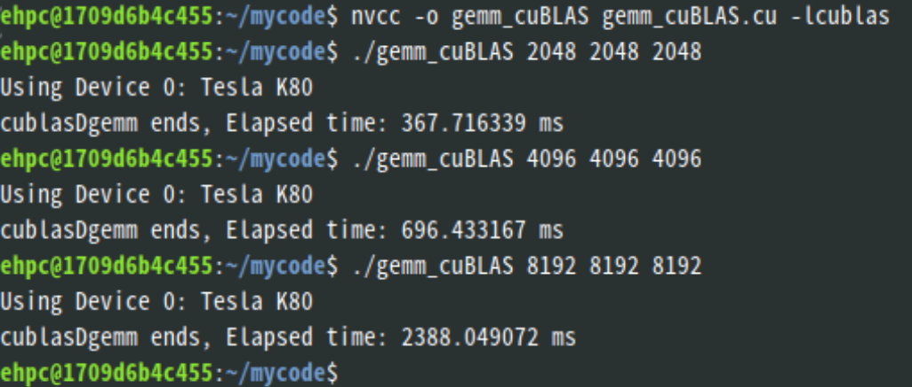
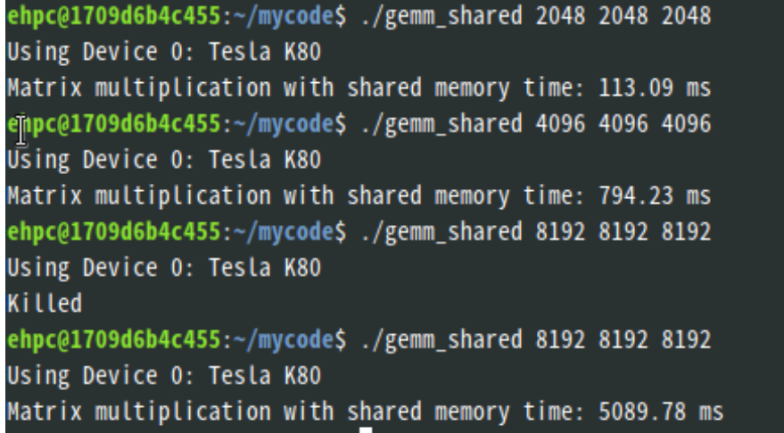
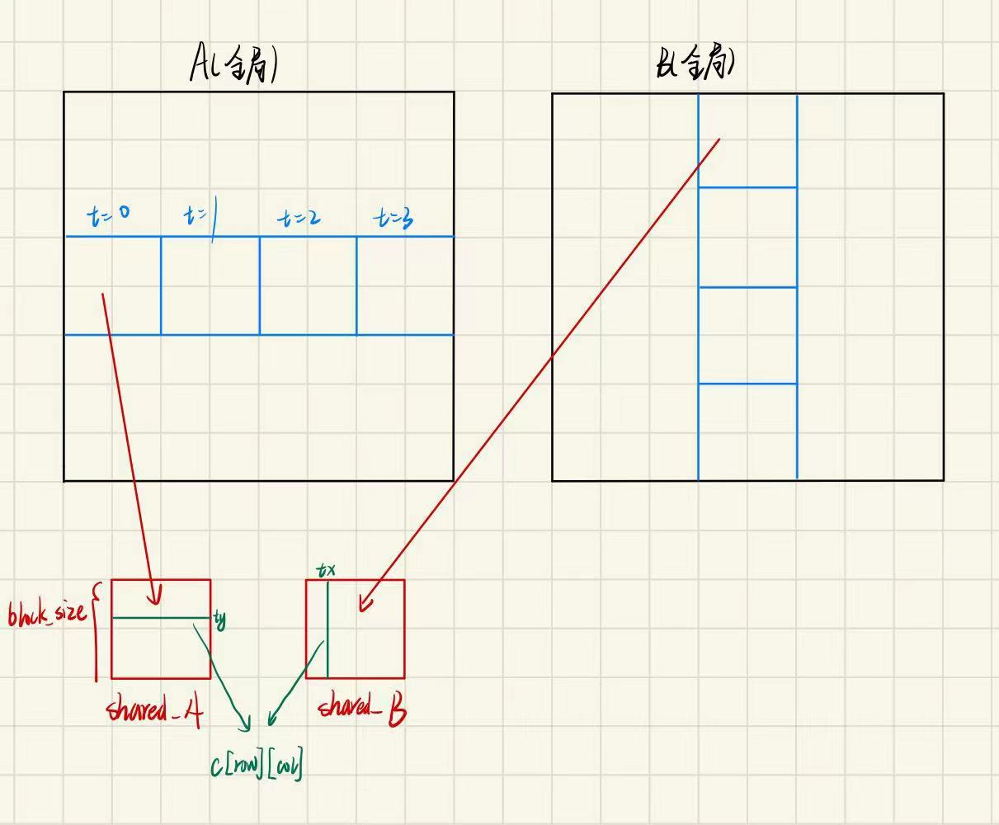

# <center>gemm-cuda
针对Tesla K80芯片进行的矩阵乘法库函数优化和封装，实测性能在中小型矩阵（小于4096*4096）优于英伟达官方的cuBlas乘法库

### 效果展示





<font color=blue>可以看到，shared memory在小矩阵性能优于cuBLAS，但随着矩阵规模的增大，cuBLAS表现出明显的优势。

通过和老师的交流，我认为原因在于cuBLAS存在内核启动的开销，另外cuBLAS使用内存比较保守。</font>

### 算法原理
<font color=blue>实现过程中，由于global memory的访存速度比较慢，使用每个block的shared memory以加速访存，具体的优化操作是在每个__global__核函数中使用__shared__在shared memory开辟内存

k80显卡每个SM的shared memory大小为48KB（49152 字节），因此在开辟空间时需要注意不要超过这个范围。</font>

实现采取<font color=blue>分块矩阵</font>的思想，在每个线程块中为矩阵A和矩阵B开辟32*32大小的共享内存，在每个SM运行过程中，不断将新的A_block和B_block移动到共享内存中进行更新。这样，当t迭代进行完毕后，SM中保存了$blocksize \times blocksize$大小的C矩阵。

计算过程如下



**核心代码**
main函数调用以及matrix_multiply_shared的实现
```c
    dim3 threadsPerBlock(BLOCK_SIZE, BLOCK_SIZE);
    dim3 numBlocks((K + BLOCK_SIZE - 1) / BLOCK_SIZE, (M + BLOCK_SIZE - 1) / BLOCK_SIZE);

    
    cudaEventRecord(start, 0);
    matrix_multiply_shared<<<numBlocks, threadsPerBlock>>>(d_A, d_B, d_C, M, N, K);
    
    cudaEventRecord(stop, 0);
    cudaEventSynchronize(stop);
    cudaEventElapsedTime(&elapsedTime, start, stop);

    printf("matrix_multiply_shared ends, Elapsed time: %f ms\n", elapsedTime);


__global__ void matrix_multiply_shared(double* A, double* B, double* C, int M, int N, int K) {
    __shared__ double shared_A[BLOCK_SIZE][BLOCK_SIZE];
    __shared__ double shared_B[BLOCK_SIZE][BLOCK_SIZE];

    int tx = threadIdx.x;
    int ty = threadIdx.y;

    int row = blockIdx.y * BLOCK_SIZE + ty;
    int col = blockIdx.x * BLOCK_SIZE + tx;

    double sum = 0.0f;

    // 循环分块计算
    for (int t = 0; t < (N + BLOCK_SIZE - 1) / BLOCK_SIZE; ++t) {
        
        if (row < M && t * BLOCK_SIZE + tx < N) 
            shared_A[ty][tx] = A[row * N + t * BLOCK_SIZE + tx];
        else 
            shared_A[ty][tx] = 0.0f;

        if (col < K && t * BLOCK_SIZE + ty < N) 
            shared_B[ty][tx] = B[(t * BLOCK_SIZE + ty) * K + col];
        else 
            shared_B[ty][tx] = 0.0f;
        
        __syncthreads(); 

        // 计算子块
        for (int i = 0; i < BLOCK_SIZE; ++i) {
            sum += shared_A[ty][i] * shared_B[i][tx];
        }

        __syncthreads(); // 确保共享内存不被提前覆盖
    }

    if (row < M && col < K) {
        C[row * K + col] = sum;
    }
}
```
